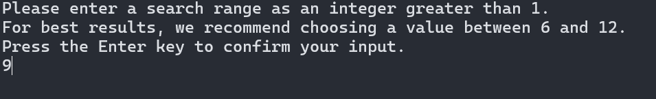
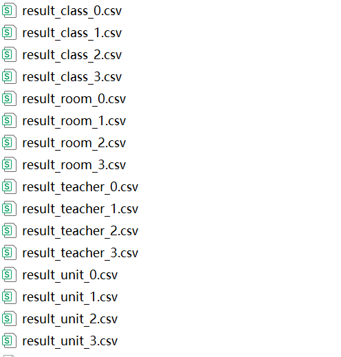

# CourseMasterX
### 一款用于高校的排课程序，本程序致力于高效的解决高校中排课问题
### 使用条件
windows操作系统

英伟达显卡（RTX4070已测试）

建议有一定的电脑使用能力

### 软件下载
压缩包中包含两个文件，解压缩。

如果操作系统提示存在安全威胁，点击允许运行即可，否则操作系统会自动将程序文件删除。

1 courseMaterX.exe 主程序，双击后执行排课程序。

2 really_data_csv 文件夹中包含有待排课的文件。

### 程序运行
1 双击courseMaterX.exe，运行默认配置，检查程序是否正常运行。

2 这里提示你输入搜索的范围，数值越大，程序尝试搜索的范围越大，这里输入9。

3等待程序运行结束后，查看是否生成了排课结果文件，分别是result_class_0.csv result_room_0.csv result_teacher_0.csv result_unit_0.csv。如果生成了更多的文件，没关系，这代表生成了多个排课方案。

### 配置文件
如果上面的步骤都顺利，接下来就可以学习如何进行文件配置了。配置文件都在really_data_csv文件夹中，本程序中所有涉及的文件都是csv格式。