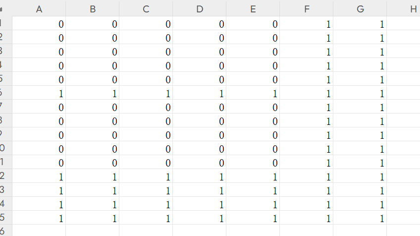

# CourseMasterX
### 高效解决高校中排课问题
### 使用条件
windows操作系统

英伟达显卡（RTX4070已测试）

有一定的计算机基础

### 软件下载
压缩包中包含两个文件，解压缩。

如果操作系统提示存在安全威胁，点击允许运行即可，否则操作系统会自动将程序文件删除。

1 courseMaterX.exe 主程序，双击后执行排课程序。

2 really_data_csv 文件夹中包含有待排课的文件。

### 程序运行
1 双击courseMaterX.exe，运行默认配置，检查程序是否正常运行。

2 这里提示你输入搜索的范围，数值越大，程序尝试搜索的范围越大，这里输入9。

3等待程序运行结束后，查看是否生成了排课结果文件，分别是result_class_0.csv result_room_0.csv result_teacher_0.csv result_unit_0.csv。如果生成了更多的文件，没关系，这代表生成了多个排课方案。

### 配置文件
如果上面的步骤都顺利，接下来介绍如何配置文件。

配置文件都在really_data_csv文件夹中，本程序中所有涉及的文件都是csv格式。

csv文件可以用office excel或者wps excel打开进行修改。

| 名称         | 功能           | 功能          |            |
|--------------|----------------|---------------|----------------|
| class.csv  | 班级信息   | 用于读取人数  |    |
| room.csv     | 教室信息   | 教室类型和容量   |   |
| cut.csv    | 分课信息   | 课次的划分   |    |
| unit.csv     | 课程计划   | 待排的教学计划  |      |

### class.csv
id：班级id，自然数

size：班级人数 自然数

### room.csv
id：教室id，自然数

type：教室的类型，自然数，例如普通教室，计算机机房，化学实验室，一些课程的教室类型需要指定

size：容纳人数

其余字段目前不使用，空着即可。

### cut.csv
id:分课的id

data：分课的方式，例如2 2表示每周上两次课，每次连上两节；4 4 4表示每周上三次课，每次连上四节

注意data中的数字之间用空格分割

### unit.csv
每行代表一个课程安排

class_id：班级id，可多个，用空格分割，自然数

teacher_id:教师id，可多个，用空格分割，自然数

course:课程id，自然数

room_tyoe:所需教室类型，和room.csv中的type字段对应，填入所需的教室type数字

week_num:未使用

cut：填写该门课每周的分课方式，对应cut.csv中的分课id

merge：未使用

time_type:填写使用哪个time文件，稍后说明。

vacation：未使用

week_start：未使用

week_end：未使用

### time/
time文件夹中包含两个文件，1.csv和2.csv，明白规则后你可以自定义上课的时间段。这里以1.csv为例：

这是一张课表，7列代表7天，每天有15个时间段可以安排课程。

周一到周五的“上午”有5个时间段是0，可以安排课程，“下午”也有5个时间段是0，可以安排课程。

假设有一门课需要连上两节，每周一次，那么程序就会从周一到周五10个时间区间内，选择一个时间区间，将这门课安排进去。

如果一门课需要连上两节，每周二次，程序会选择两个不同的时间区间，分开安排；不会将两次课安排到同一个区间内。

举例：如果有一门课要求连上6节，按照1.csv的设置，能安排吗？

答：不能，因为没有任何一个区间内能够容纳连续六节课，建议拆分成两次授课，例如“3 3”或者“2 4”等情况，满足单次占用课时小于等于5。