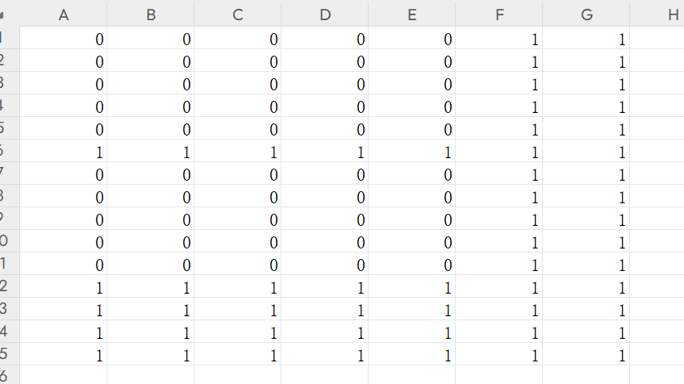

# 🎓 CourseMasterX  
Quickly and efficiently solve university course scheduling problems, making scheduling easier!  
---
Applicable for scheduling by class

[📄 中文](README.md)  
## ⚙️ **Requirements**  
Ensure the following environment requirements are met:  
- **Operating System**: 🖥️ Windows  
- **Graphics Card**: 🎮 NVIDIA GPU capable of running CUDA programs (tested on RTX 4070, RTX 2060 ✅; other models not yet tested).  

---

## 📥 **Software Download**  

1. **Download and Extract the Program**  

   📦 After downloading the compressed file, extract it. If your operating system warns of potential security threats, choose **Allow to Run**. ⚠️ If not allowed, the system may automatically delete program files.  

2. **File Description**:

   - **`CourseMasterX.exe`**: 🚀 The main program file. Double-click to execute the scheduling tasks.  
   - **`really_data_csv` folder**: 📂 Contains sample files for scheduling, provided for testing and reference.  

---

## **Running the Program**

1. **Launch the Program**  
   Double-click `CourseMasterX.exe` to run the program with default configurations and check whether it launches correctly.

2. **Set Search Range**  
   Once the program starts, it will prompt you to input the search range.  
   - **Recommended Value**: `9` (Larger values increase the search range the program attempts).

3. **Output Results**  
   After execution, check whether the result files are generated, including:
   - `result_class_0.csv`
   - `result_room_0.csv`
   - `result_teacher_0.csv`
   - `result_unit_0.csv`

   If more files are generated, don’t worry. This indicates that multiple scheduling plans have been generated.

---

## **University Configuration File Description**

After completing the basic operations, learn how to modify configuration files to meet specific user requirements.

### **Configuration File Location**
All configuration files are located in the `really_data_csv` folder. All files used by this program are in **CSV format**, which can be opened and edited using **Office Excel**, **WPS Excel**, or a text editor.

---

### **List of Configuration Files**
| File Name       | Description     | Function                       |    
|-----------------|-----------------|--------------------------------|
| `class.csv`     | Class Information | Contains details like class sizes |
| `room.csv`      | Room Information  | Includes room types and capacities |
| `cut.csv`       | Course Splitting Information | Defines how courses are split |    
| `unit.csv`      | Course Plan      | Includes teaching plans to be scheduled |      

---

### **class.csv**
| Field Name | Description              | Type   |
|------------|--------------------------|--------|
| id         | Class ID                 | Integer |
| size       | Number of Students       | Integer |

---

### **room.csv**
| Field Name | Description                     | Type   |
|------------|----------------------------------|--------|
| id         | Room ID                         | Integer |
| type       | Room Type                       | Integer |
| size       | Capacity                        | Integer |
| Other Fields | Unused                        | Default to 0 |

---

### **cut.csv**
| Field Name | Description                             | Type   |
|------------|----------------------------------------|--------|
| id         | Course Splitting ID                   | Integer |
| data       | Splitting Method, e.g., `2 2` or `4 4 4` | Space-separated integers |

---

### **unit.csv**
| Field Name    | Description                                                  | Type       |
|---------------|--------------------------------------------------------------|------------|
| class_id      | Class ID(s), multiple IDs separated by spaces                | Integer    |
| teacher_id    | Teacher ID(s), multiple IDs separated by spaces              | Integer    |
| course        | Course ID                                                    | Integer    |
| room_type     | Required Room Type, corresponds to the `type` field in `room.csv` | Integer    |
| week_num      | Unused                                                       | -          |
| cut           | Weekly Splitting Method, corresponds to `cut.csv` splitting ID | Integer    |
| merge         | Unused                                                       | -          |
| time_type     | Time configuration file name                                 | String     |
| vacation      | Unused                                                       | -          |
| week_start    | Unused                                                       | -          |
| week_end      | Unused                                                       | -          |

---

### **time Folder**

The `time` folder contains two time configuration files: `1.csv` and `2.csv`, used to customize class schedules. Taking `1.csv` as an example:

- The table contains 7 columns, corresponding to the 7 days of the week, with 15 time slots per day.
  - **Marked with `1`**: Unavailable time slots.
  - **Marked with `0`**: Available time slots.
- For example:
  - On Monday to Friday, the mornings have 5 `0` slots, and the afternoons also have 5 `0` slots, which can be used for scheduling classes.

---

### **Special Cases**

#### Example Question:
**If a course requires 6 consecutive periods, can it be scheduled based on the settings in `1.csv`?**

**Answer**: No, because no single time block accommodates 6 consecutive periods.  
It is recommended to split the course into two sessions, such as "3 3" or "2 4," ensuring each session uses fewer than or equal to 5 periods.

---

## **Result File Description**

CSV files with the same trailing numbers belong to the same scheduling plan. For example:  
`result_room_0.csv`, `result_teacher_0.csv`, `result_unit_0.csv`, and `result_class_0.csv` are part of the same scheduling plan.

---

### **result_room_0.csv**
| Field Name | Description                                                      |
|------------|------------------------------------------------------------------|
| room       | Room ID assigned to a course plan                                |
| course     | Course ID                                                       |
| day        | A group of 3 numbers indicating day of the week, start period, and end period (field name may vary) |
| start      | Unused                                                          |
| end        | Unused                                                          |
| Notes      | Each row corresponds to the rows in `unit.csv`.                 |
---

### **result_teacher_0.csv**
| Field Name | Description                                                      |
|------------|------------------------------------------------------------------|
| teachers   | Teacher ID(s)                                                   |
| course     | Course ID                                                       |
| day        | A group of 3 numbers indicating day of the week, start period, and end period (field name may vary) |

---

### **result_unit_0.csv**
| Field Name | Description                                                      |
|------------|------------------------------------------------------------------|
| day        | Same as above                                                   |
| Notes      | Each row corresponds to the rows in `unit.csv`.                 |
---

### **result_class_0.csv**
| Field Name | Description                                                      |
|------------|------------------------------------------------------------------|
| classes    | Class ID(s)                                                     |
| course     | Course ID                                                       |
| day        | Same as above                                                   |

## **Primary and Secondary School Scheduling Configuration Description**
Compared to universities, scheduling for primary and secondary schools in fixed classrooms requires some modifications to the configuration files.

The program defaults to reading content from the `really_data_csv` folder. Therefore, copy all files from the `really_school_data_csv` folder into the `really_data_csv` folder to replace the original files.

---

### **List of Configuration Files**
| File Name       | Description     | Function                       |    
|-----------------|-----------------|--------------------------------|
| `class.csv`     | Class Information | The actual class size is not important; it just needs to be less than or equal to the classroom size in `room.csv`. |    
| `room.csv`      | Room Information  | Assign each room a unique `type` to ensure it is allocated correctly in `unit.csv`. |   
| `cut.csv`       | Course Splitting Information | Adjusted based on actual needs. |    
| `unit.csv`      | Course Plan      | Ensure `class_id` and `room_id` match. |    

---

The following explains the files in `really_school_data_csv` one by one.

### **class.csv**
| id | size              |    
|----|-------------------|
| 0  | 50                | 
| 1  | 50                |
---
This file indicates there are two classes, ID 0 and 1, each with a size of 50 students.

Since room arrangement is fixed, the size here can be set arbitrarily.

### **room.csv**
| id | building | floor | name | type | size |
|----|----------|-------|------|------|------|
| 0  | 0        | 0     | 0    | 0    | 50   |
| 1  | 0        | 0     | 0    | 0    | 50   |
---
This file provides two rooms, IDs 0 and 1, each with a capacity of 50 students.

Fields `building`, `floor`, and `name` are unused and can default to 0.

### **cut.csv**
| id | data                             | 
|----|----------------------------------|
| 0  | 1 1 1 1 1                        |
| 1  | 1 1 1 1                          | 
| 2  | 1 1 1                            | 
---
- `id=0`: 5 sessions per week, 1 session each time.  
- `id=1`: 4 sessions per week, 1 session each time.  
- Each `1` is separated by spaces. Changing `1` to `2` would mean 2 sessions each time.

### **unit.csv**
| class_id | teacher_id | course | room_type | week_num | cut | merge | time_type | vacation | week_start | week_end |
|----------|------------|--------|-----------|----------|-----|-------|-----------|----------|------------|----------|
| 0        | 0          | 0      | 0         | 0        | 0   | 0     | 1.csv     | 0        | 0          | 0        |
| 0        | 1          | 1      | 0         | 0        | 0   | 0     | 1.csv     | 0        | 0          | 0        |
| 0        | 2          | 2      | 0         | 0        | 0   | 0     | 2.csv     | 0        | 0          | 0        |
| 0        | 3          | 3      | 0         | 0        | 0   | 0     | 1.csv     | 0        | 0          | 0        |
| 0        | 4          | 4      | 0         | 0        | 0   | 0     | 2.csv     | 0        | 0          | 0        |
| 1        | 0          | 0      | 1         | 0        | 0   | 0     | 1.csv     | 0        | 0          | 0        |
| 1        | 1          | 1      | 1         | 0        | 0   | 0     | 1.csv     | 0        | 0          | 0        |
| 1        | 2          | 2      | 1         | 0        | 0   | 0     | 2.csv     | 0        | 0          | 0        |
| 1        | 3          | 3      | 1         | 0        | 0   | 0     | 1.csv     | 0        | 0          | 0        |
| 1        | 4          | 4      | 1         | 0        | 0   | 0     | 2.csv     | 0        | 0          | 0        |
---
Here, classroom 0 is assigned to class 0, and classroom 1 is assigned to class 1.

To achieve this, set all `room_type` fields to 0 for rows where `class_id=0`. Since type 0 corresponds to room ID 0 in `room.csv`, classroom 0 is fixed for class 0.

Similarly, set all `room_type` fields to 1 for rows where `class_id=1`, fixing classroom 1 for class 1. (You can reverse the assignments if needed.)

The `time_type` field uses two example files: `1.csv` and `2.csv`.

`1.csv`
|   |   |   |   |   |   |   |
|---|---|---|---|---|---|---|
| 0 | 0 | 0 | 0 | 0 | 1 | 1 |
| 0 | 0 | 0 | 0 | 0 | 1 | 1 |
| 0 | 0 | 0 | 0 | 0 | 1 | 1 |
| 1 | 1 | 1 | 1 | 1 | 1 | 1 |
| 1 | 1 | 1 | 1 | 1 | 1 | 1 |
| 1 | 1 | 1 | 1 | 1 | 1 | 1 |
| 1 | 1 | 1 | 1 | 1 | 1 | 1 |
| 1 | 1 | 1 | 1 | 1 | 1 | 1 |
| 1 | 1 | 1 | 1 | 1 | 1 | 1 |
---
`1.csv` specifies that the first 3 periods of each day (marked as `0`) are available for scheduling classes.

`2.csv`
|   |   |   |   |   |   |   |
|---|---|---|---|---|---|---|
| 1 | 1 | 1 | 1 | 1 | 1 | 1 |
| 1 | 1 | 1 | 1 | 1 | 1 | 1 |
| 1 | 1 | 1 | 1 | 1 | 1 | 1 |
| 0 | 0 | 0 | 0 | 0 | 1 | 1 |
| 1 | 1 | 1 | 1 | 1 | 1 | 1 |
| 0 | 0 | 0 | 0 | 0 | 1 | 1 |
| 0 | 0 | 0 | 0 | 0 | 1 | 1 |
| 1 | 1 | 1 | 1 | 1 | 1 | 1 |
| 1 | 1 | 1 | 1 | 1 | 1 | 1 |
---
`2.csv` specifies that only the 4th, 6th, and 7th periods of each day (marked as `0`) are available for scheduling.

The remaining components are identical to university scheduling settings and can be referenced in the earlier section.
